title: P3、PipeDream、GPipe - Large-Scale Distributed Training Modern Approaches
speaker: 荣懿
url: https://rongyi.io
prismTheme: solarizedlight
js:
    - https://www.echartsjs.com/asset/theme/infographic.js
plugins:
    - echarts: {theme: infographic}
    - mermaid: {theme: forest}
    - katex

<slide class="bg-apple aligncenter">

# P3、PipeDream、GPipe {.text-shadow}

Large-Scale Distributed Training - Modern Approaches {.text-intro.animated.fadeInUp.delay-500 .text-shadow}

<br /><br /><br /><br /><br /><br />

> 荣懿 [\<https://rongyi.io\>](https://rongyi.io)

Link to this presentation [```https://p.rongyi.io/190809```](https://p.rongyi.io/190809)  
Contact Me [```i@rongyi.io```](mailto:i@rongyi.io) or [```rongyi.ry@alibaba-inc.com```](mailto:rongyi.ry@alibaba-inc.com)
<!--[:fa-link: Github](https://github.com/ksky521/nodeppt){.button.ghost.animated.flipInX.delay-1200}-->

<slide class="size-60 aligncenter text-apple">

## Background

---

### 1. Training Process {.text-shadow .animated.fadeInUp}  
### 2. Data Parallelism (_input partitioning_) {.text-shadow .animated.fadeInUp}  
### 3. Model Parallelism (_network structure partitioning_) {.text-shadow .animated.fadeInUp}  
### 4. Pipelining (_layer partitioning_) {.text-shadow .animated.fadeInUp}  
### 5. Hybrid Pipelining {.text-shadow .animated.fadeInUp}  


<slide :class="aligncenter text-shadow text-apple">

# The Training Process
## DNN Architecture

---

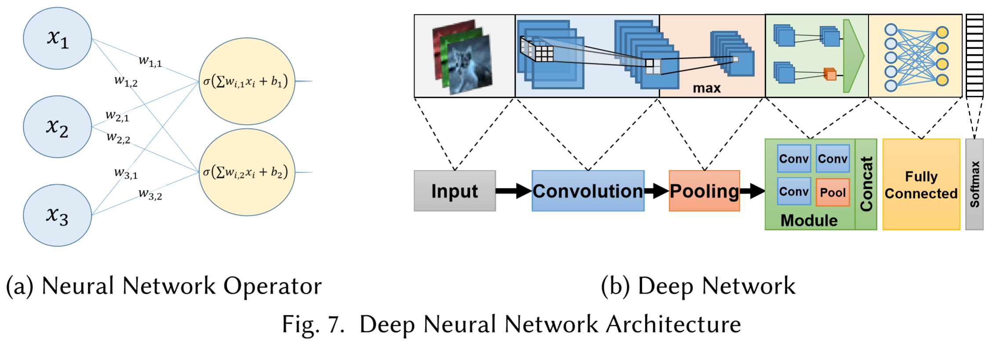

<slide :class="aligncenter text-shadow text-apple">

# The Training Process
## Forward Evaluation & Backpropagation
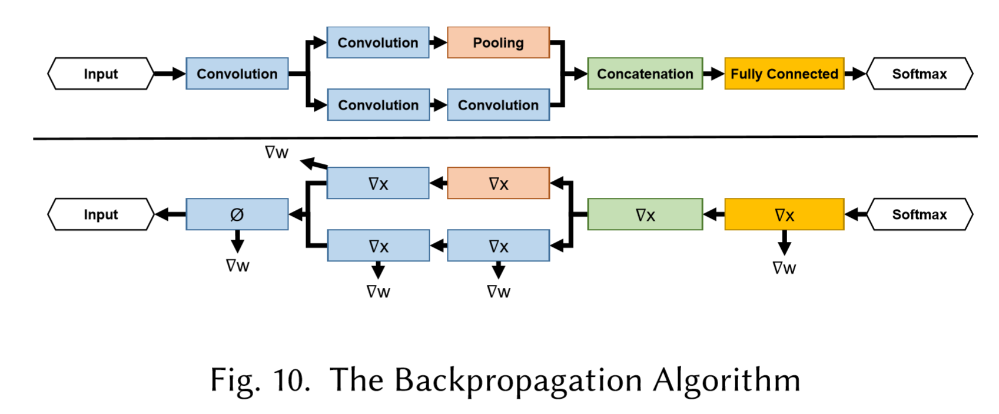


<slide :class="aligncenter text-apple">

# Data Parallelism {.text-shadow}
:::column {.vertical-align}

#### The **data** is partitioned across multiple GPUs
#### Each GPU has a full copy of the model     
#### Train on its own weight
#### Synchronize with other GPUs

---

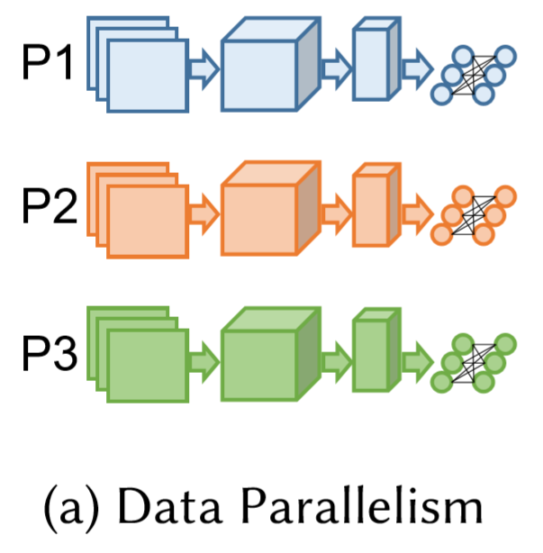

<slide :class="text-apple">

# Problems with Data Parallelism {.text-shadow .aligncenter}
:::column {.vertical-align}

## Sync Strategy
#### Bulk Synchronization Parallel (BSP)
#### Asynchronous Parallel (ASP)

## Bottlenecks
#### Batch Normalization & Weight Updates

---

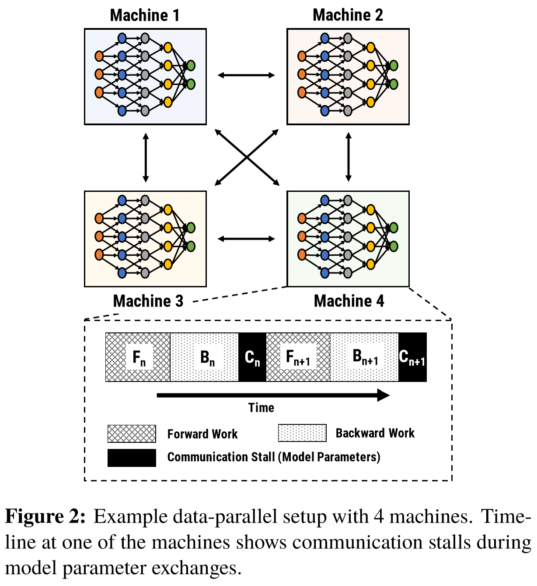

---

## Finer-Grained Data Parallelism
#### Pipelined Execution
#### Asynchronous Execution 
#### Decompose Minibatch

<slide :class="aligncenter text-apple">

# Model Parallelism {.text-shadow}
:::column {.vertical-align}

#### The **model** is partitioned across multiple GPUs
#### Each GPU train only a portion of the model   
#### Saves GPU memory with only a partial model
#### Requires communication after each layer

---

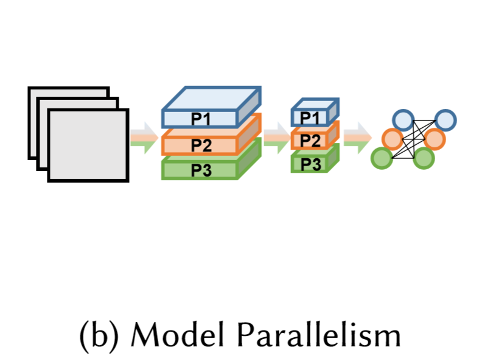


<slide :class="text-apple">

# Problems with Model Parallelism {.text-shadow .aligncenter}
:::column {.vertical-align}

## GPU Under-Utilization

## Data Partitioning Point Solution

## Communication after every layer
#### Fully connected layer (FC) requires an all-to-all communication

---

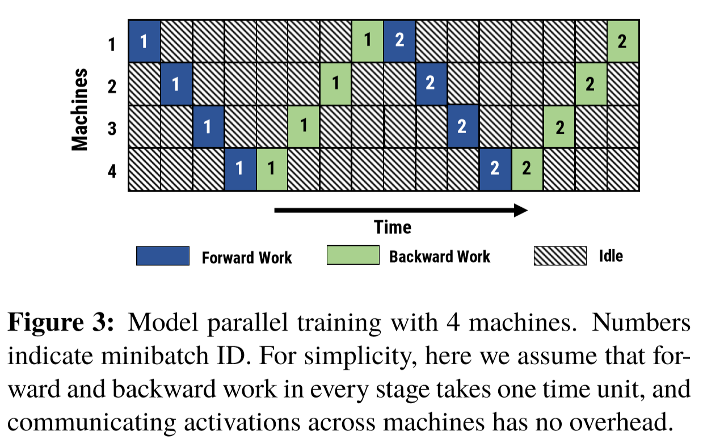


<slide :class="aligncenter text-apple">

# Pipelining {.text-shadow}
:::column {.vertical-align}

## Variant 1
#### Overlapping computation between one layer and the next
##### Forward Evaluation
##### BackPropagation
##### Weight updates

## Variant 2
#### Partition DNN according to depth and assign layers to different GPUs


---

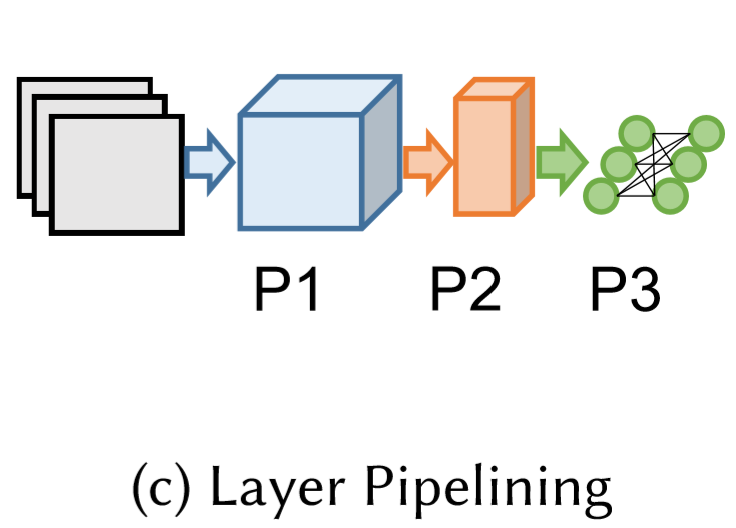


<slide :class="text-apple">

# Pipelining Var.2 (Layer partitioning) {.text-shadow .aligncenter}
:::column {.vertical-align}

## Pros
#### 1. No need to store full parameters on every GPU
#### 2. Communication pattern is fixed
#### 3. Layers at each GPU are fixed, allowing weight caching to decrease memory round-trips

---

## Cons
#### 1. Data has to arrive at a specific speed in order to fully utilize the system
#### 2. Latency proportionally increase with number of GPUs


<slide class="bg-apple aligncenter">
# Priority-Based Parameter Propagation

## For Distributed DNN Training

---

### A.K.A. P3

--- 

University of British Columbia & Vector Institute

<slide :class="text-apple">

# Observations {.text-shadow .aligncenter}
:::column {.vertical-align}

## 1. Temporal gap between data generated and consumed

## 2. Finer sub-layer-level granularity improves network utilization {.aligntop}
#### Heavy models with skewed weight size
##### VGG16, VGG19
##### Sockeye

---


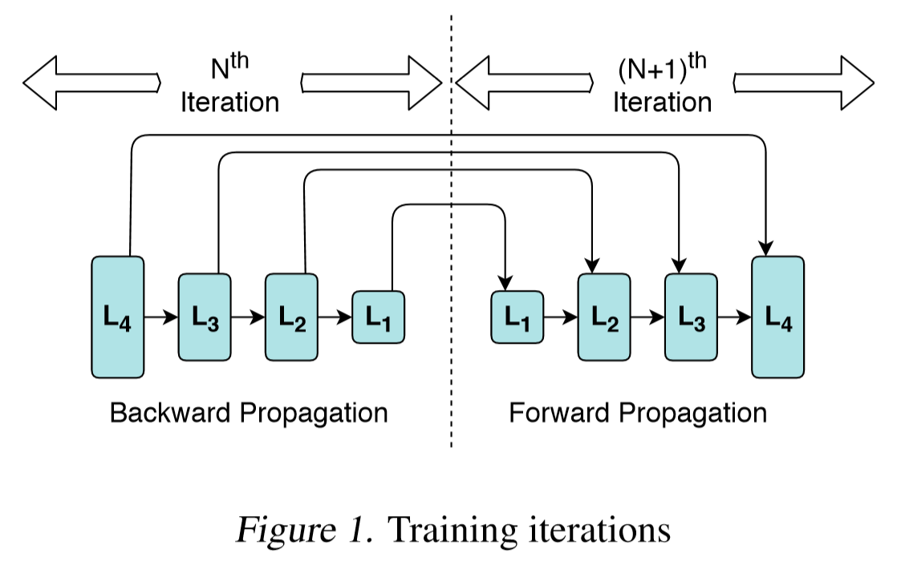

<slide :class="text-apple">

# 1. Priority-based Propagation {.text-shadow .aligncenter}
:::column {.vertical-align}

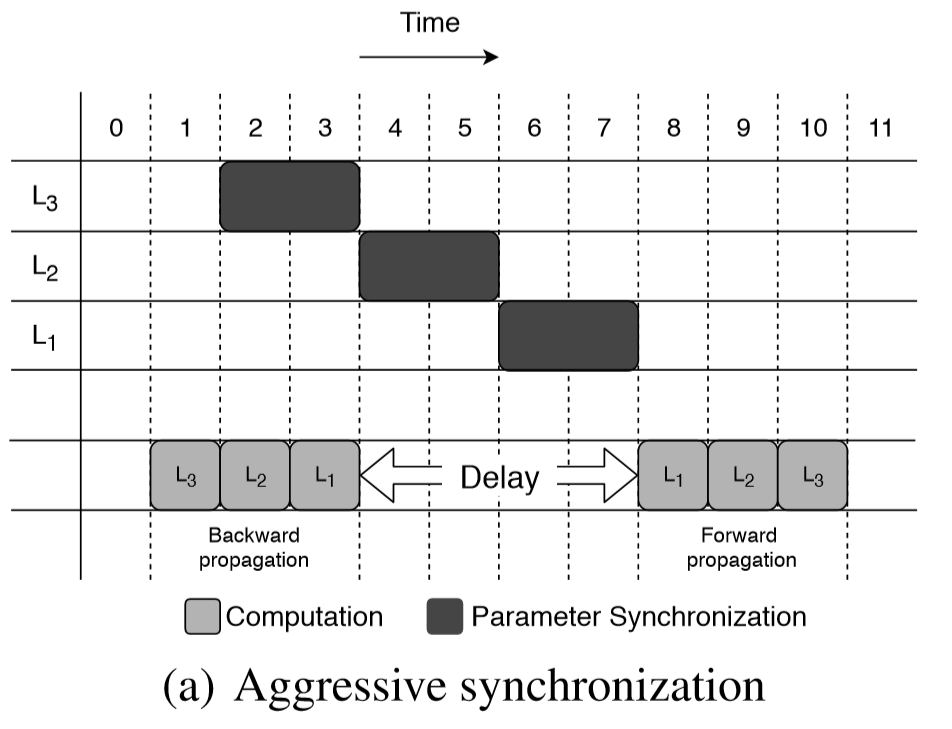

---


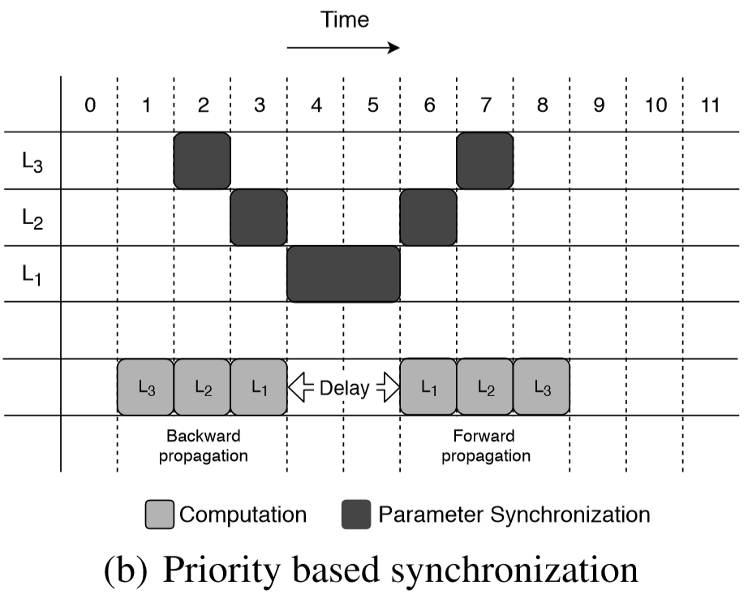


<slide :class="text-apple">

# 2. Parameter Slicing {.text-shadow .aligncenter}
:::column {.vertical-align}

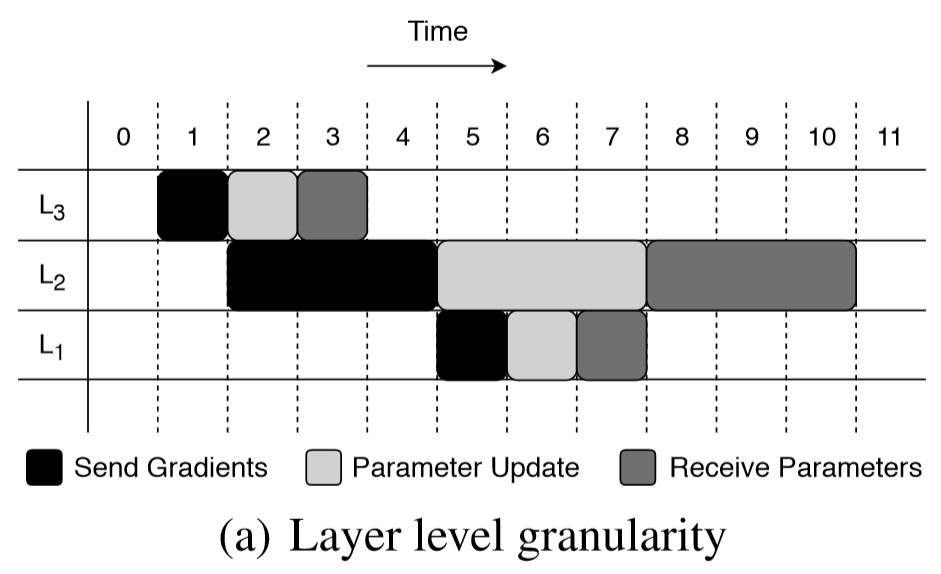

---


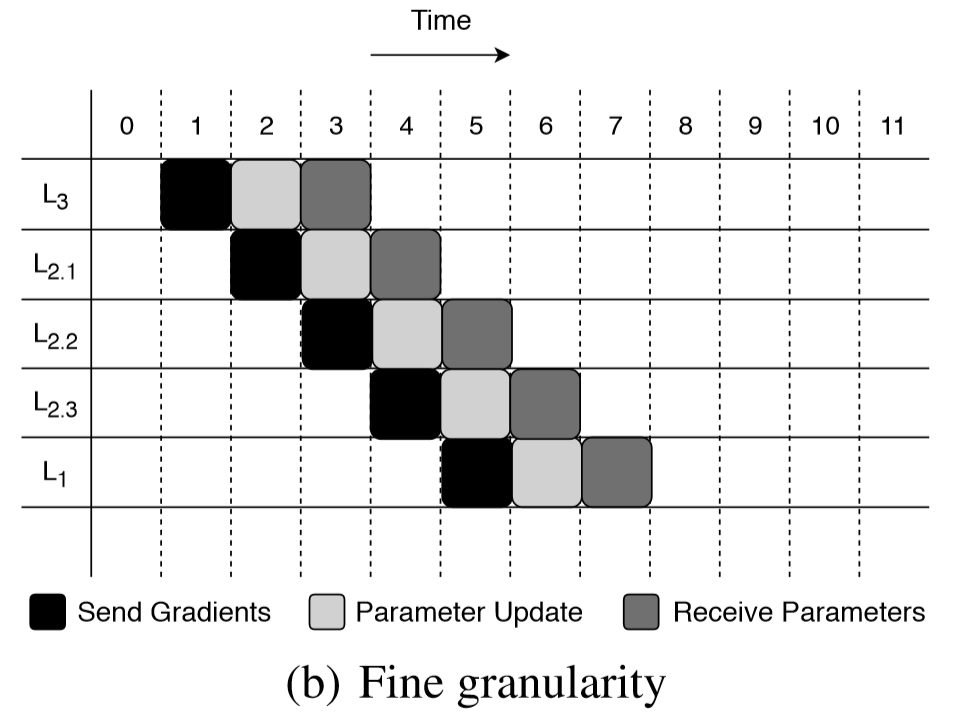


<slide :class="text-apple aligncenter size-70">
# Applications on VGG16
:::column {.vertical-align}
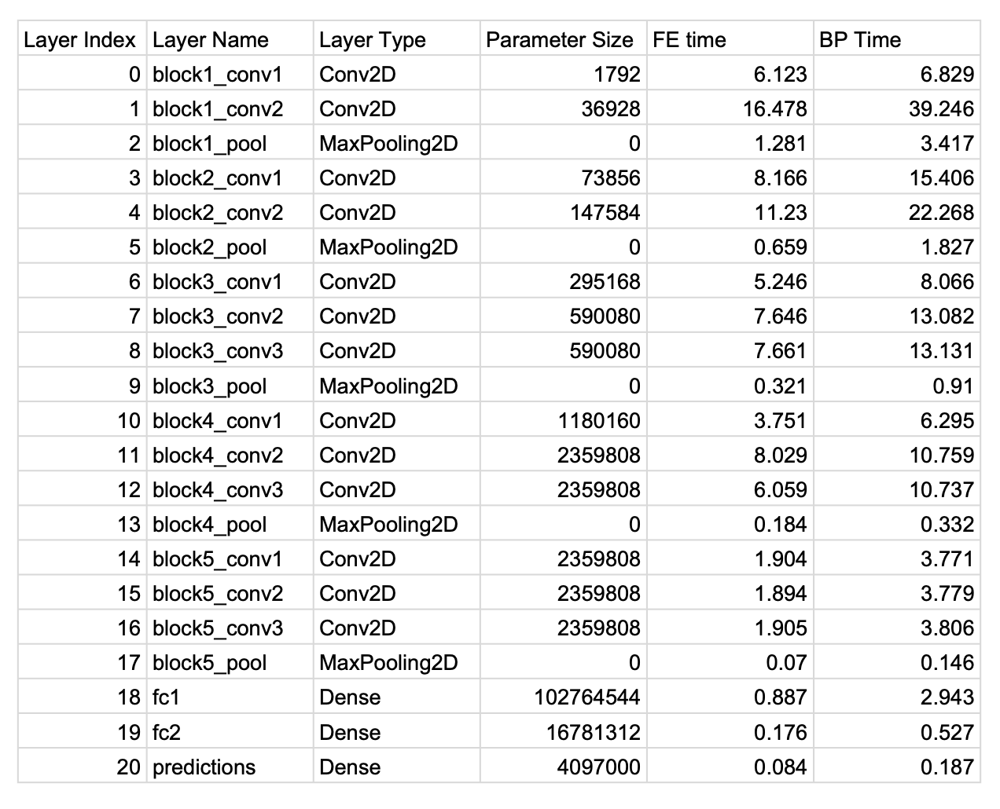

---

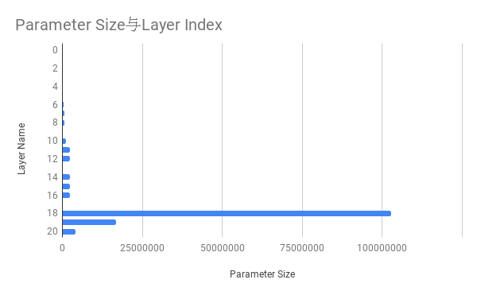
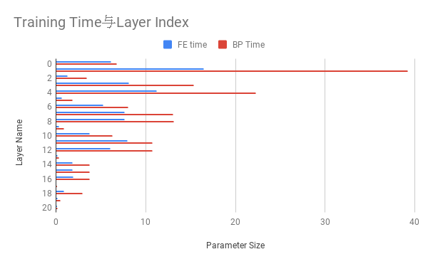

<slide :class="text-apple aligncenter">
# Applications on VGG16
### Gap between 1st and 2nd Conv2D
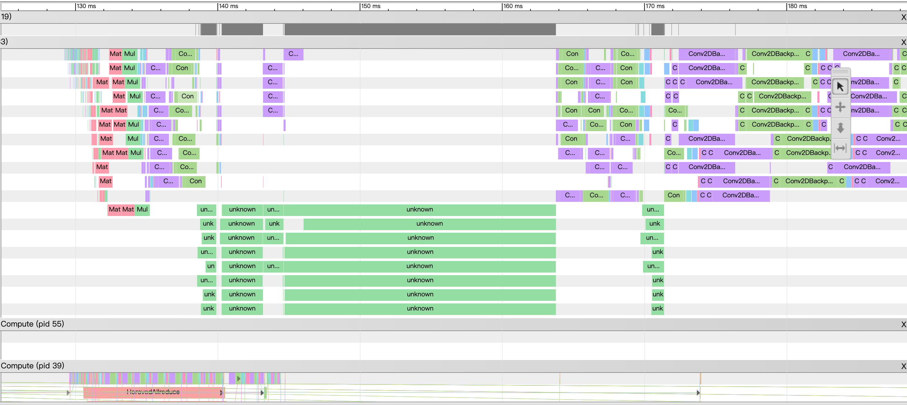


<slide :class="text-apple aligncenter">
# Applications on VGG16
### Gap between FE and BP
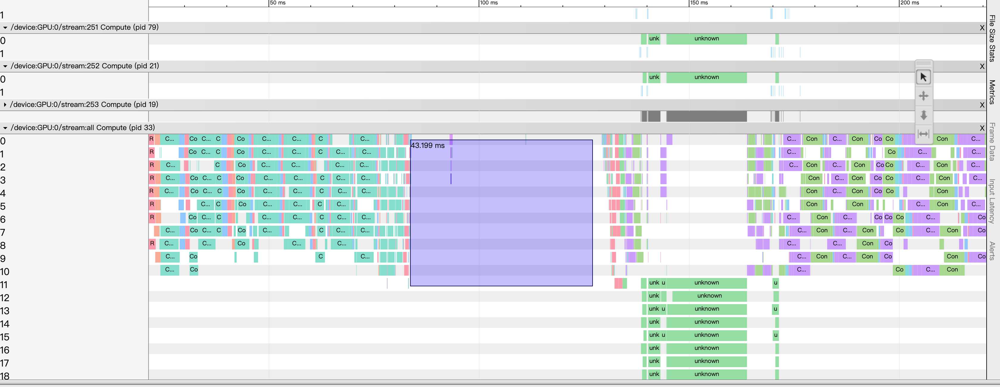

<slide :class="text-apple aligncenter">
# P3 Simulation w/ VGG data
:::column {.vertical-align}

```go
func P3Simulation(ds *DataStats, ms *ModelStats) float64 {
	// Data Preparation
	curts := 0.0 // current timestamp
	for i := len(ms.Layers) - 1; i >= 0; i-- {
		m := ms.Layers[i]
		var db DataBlock
		db.Size = m.ParamNum * 4
		db.ETA = float64(db.Size) / Bandwidth
		fmt.Printf("ETA for %d: %f\n", i, db.ETA)
		curts += m.BackTime
		db.AvailableTime = curts
		ds.Blocks = append(ds.Blocks, db)
	}
	n := len(ds.Blocks)
	for i := 0; i < n; i++ {
		b := &ds.Blocks[i]
		fmt.Printf("%f - %f\n", b.AvailableTime, curts)
		b.StdAvailableTime = b.AvailableTime - curts // - b.AvailableTime
	}
	curts = 0.0
	for i, m := range ms.Layers {
		curts += m.FwdTime
		ds.Blocks[i].NeedTime = curts
		ds.Blocks[i].CompTime = m.FwdTime
	}
	fmt.Printf("DS: %v\n", *ds)
```

---

```go
	// Sequential Simulation
	ds.Blocks[n-1].DriftBack += ds.Blocks[n-1].ETA
	ds.Offset += ds.Blocks[n-1].DriftBack

	for i := n - 2; i >= 0; i-- {
		prevSlot := ds.Blocks[i+1].AvailableTime - ds.Blocks[i].AvailableTime
		afterSlot := ds.Blocks[i+1].CompTime
		if prevSlot+afterSlot < ds.Blocks[i].ETA { // need to further drift back
			if ds.Blocks[i].ETA-(prevSlot+afterSlot) < ds.Excess { // try to use Excess first
				fmt.Printf("Excess before use: %f\n", ds.Excess)
				ds.Excess -= ds.Blocks[i].ETA - (prevSlot + afterSlot)
				fmt.Printf("Excess after use: %f\n", ds.Excess)
			} else {
				fmt.Printf("Excess before use: %f\n", ds.Excess)
				ds.Blocks[i].DriftBack = ds.Blocks[i].ETA - (prevSlot + afterSlot) - ds.Excess
				ds.Offset += ds.Blocks[i].DriftBack
				ds.Excess = 0
				fmt.Printf("Excess after use: %f\n", ds.Excess)
			}
		} else {
			ds.Excess += prevSlot + afterSlot - ds.Blocks[i].ETA
		}
	}
	fmt.Printf("Final Offset: %f\n", ds.Offset)
	fmt.Printf("Pure Computational Time: %f\n", ms.AllCompTime)
	return ds.Offset
}
```

<slide class="bg-apple aligncenter">
# PipeDream

## Fast and Efficient Pipeline Parallel DNN Training


--- 

Carnegie Mellon University  
Microsoft Research  
Stanford University  

<slide :class="text-apple size-60">

# Observations {.text-shadow .aligncenter}
:::column {.vertical-align}

## 1. Data Parallelism BSP scenarios


---

## 2. Model Parallelism: only 1 GPU at work


<slide :class="text-apple size-50">

# PipeDream's Approach {.text-shadow .aligncenter}
:::shadowbox

# Pipeline Parallelism
a combination of Data-, Model- Parallelism and Pipelining

---

# Layer Partitioning
The partitioning is done after a profiling run, so as to make sure each stage gets the similar amount of work, and data communicated across stages are minimized.

---

# Work Scheduling
Pipelining w/ _one-forward-one-backward_(1F1B) to make sure forward is progressing in each minibatch. Round-robin load balancing for Data Parallelism.

:::


<slide :class="text-apple">
:::column {.vertical-align}
# 1. Pipeline Parallelism

## Observation from Google
#### Data Parallelism on Convolutional Layers
#### Model Parallelism on Fully-Connected Layers
[4]: One weird trick for parallelizing convolutional neural networks - Google

## with PipeDream
#### Data Parallelism on large Convolutional Layers
#### Pipelined Model Parallelism on the entire net

---

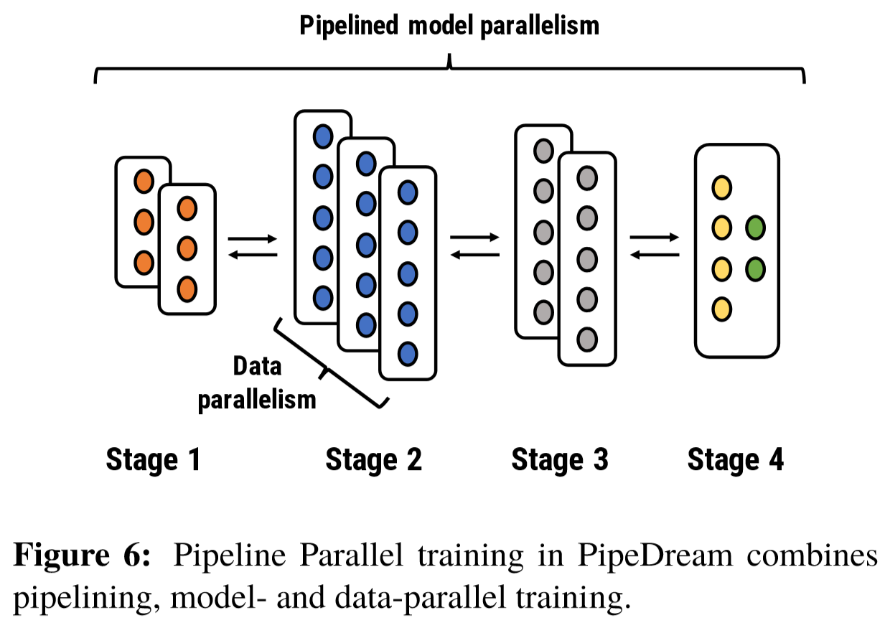


<slide :class="text-apple">
:::column {.vertical-align}
# 2. Layer Partitioning
### During the profiling
##### the following data is recorded for each layer l
- $T_l$: total computation time across forward and backward pass for the layer
- $a_l$: the size of the output activations of the layer, and the size of input gradients in the backward pass.
- $w_l$: the size of parameters for layer $l$

---

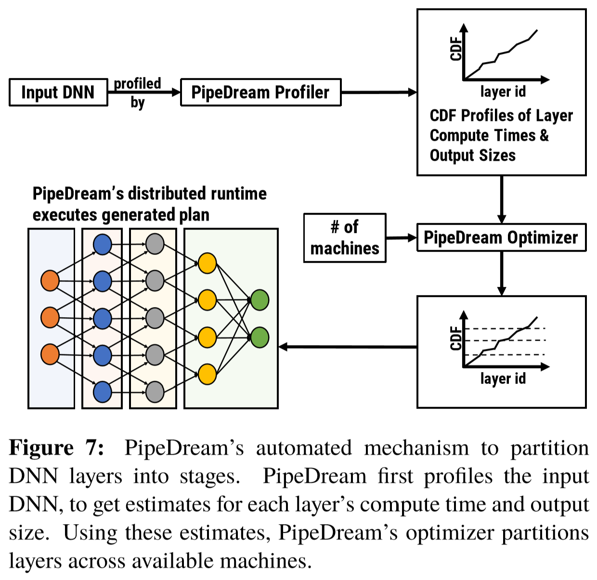


<slide :class="text-apple">
# 2. Layer Partitioning {.aligncenter}
### Partitioning Algorithm {.aligncenter}

:::column {.vertical-align}

### Notations
##### Train a DNN with $N$ layers across $M$ available machines
##### $A(j,m)$ denotes the time taken by the slowest stage in the **optimal** pipeline between layer 1 and $j$ using $m$ machines
##### $T(i \rightarrow j, m)$ denotes the time taken by a single stage spanning layers $i$ through $j$, replicated over $m$ machines
##### $T(i \rightarrow j, m) = \frac{1}{m} max (\sum_{l=i}^{j} T_l, \sum_{l=i}^{j} W_l^m)$
##### 

---

### DP Formula
#### Case 1: Optimal pipeline only has 1 stage
#### $A(j,m)=T(1\rightarrow j, m)$

#### Case 2: Optimal pipelien contains multiple stages

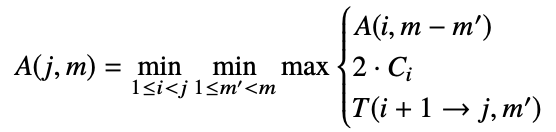

<slide :class="text-apple">
# 2. Layer Partitioning {.aligncenter}
### Implementation in Go {.aligncenter}

:::column {.vertical-align}

```go
func A(j, m int, ms *ModelStats) float64 {
	if j == 1 {
		return T(1, 1, m, ms)
	}
	if m == 1 {
		return T(1, j, 1, ms)
	}
	globalmin := math.MaxFloat64
	for i := 0; i < j; i++ {
		localmin := math.MaxFloat64
		for mp := 1; mp < m; mp++ {
			localmax := math.Max(math.Max(T(i+1, j, mp, ms), A(i, m-mp, ms)), C(i, ms))
			if localmax < localmin {
				localmin = localmax
			}
		}

		if localmin < globalmin {
			globalmin = localmin
		}
	}
	return globalmin
}
```

---

```go
func C(i int, ms *ModelStats) float64 {
	return float64(ms.Layers[i].Size) / float64(50000)
}
func T(i, j, m int, ms *ModelStats) float64 {
	TlSum, WlSum := 0.0, 0.0
	for i := 0; i < len(ms.Layers); i++ {
		TlSum = TlSum + ms.Layers[i].FwdTime + ms.Layers[i].BackTime
		WlSum = WlSum + W(i, m, ms)
	}

	return math.Max(WlSum, TlSum) / float64(m)
}

func W(i, m int, ms *ModelStats) float64 {
	return 4.0 * float64(m-1) / float64(m) * float64(ms.Layers[i].ParamNum)
}
func main() {
	ms := readFromModelSummary("model.summary")
	ms = readFromModelPerformance("model.performance", ms)
	fmt.Printf("%f\n", A(len(ms.Layers), 8, ms))
}
```

<slide :class="text-apple">
:::column {.vertical-align}
# 3. Work Scheduling
### Startup phase
##### inputs stage emits `NOAM` minibatches to the pipeline
##### $NOAM = (# machines) / (# machines in input stages)$
### Steady phase
##### each stage alternates between forward and backward pass for a minibatch (1F1B)

### for stages w/ Data Parallelism config
##### Round-Robin between multiple GPUs

<hr />

[8]: Varun Batra "PipeDream" http://pages.cs.wisc.edu/~shivaram/cs744-slides/cs744-pipedream-varun.pdf

---

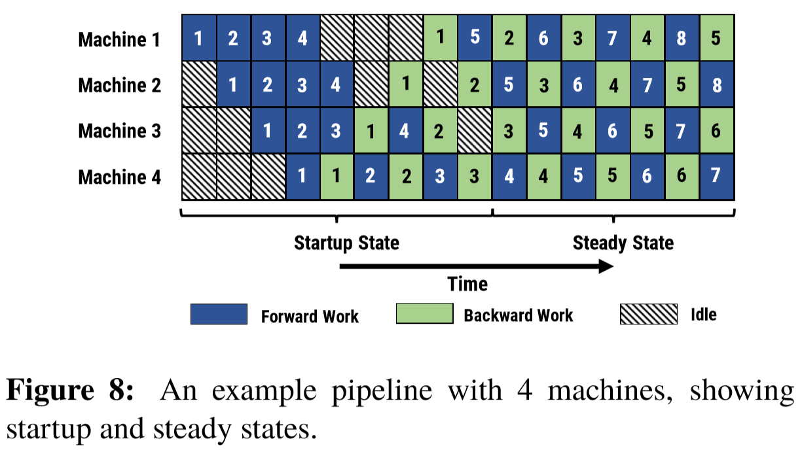


<slide :class="text-apple">
# Effective Learning
:::column {.vertical-align}
## 1. Weight Stashing
#### Maintain multiple versions of weights
##### Within a stage, same version of parameters are used for Forward and Backward pass of a given minibatch

---

## 2. Vertical Sync
#### Full synchronization of parameters
##### Eliminates the potential inconsistency _across stages_
footnote from paper: impact of vertical sync is negligible, disabled by default

<slide :class="text-apple aligncenter">
# Effective Learning
## Pipelining w/ Weight Stashing
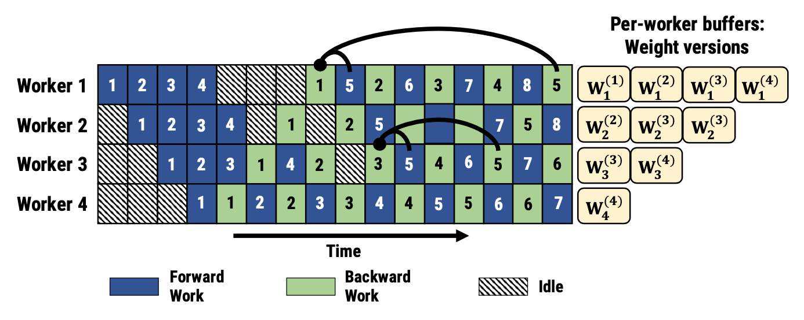

<slide class="bg-apple aligncenter">
# GPipe

### Easy Scaling with Micro-Batch Pipeline Parallelism

--- 

Google


<slide :class="text-apple size-70">
# Objectives
### GPipe
#### enables efficient training of large neural networks

### PipeDream
#### optimize “time to target accuracy”

<slide :class="text-apple size-70">
# Interface
## $f_i$
#### Forward Computation Function

## $w_i$
#### Set of Parameters

## $c_i$
#### (optional) Cost Estimation Function

<slide :class="text-apple size-70">
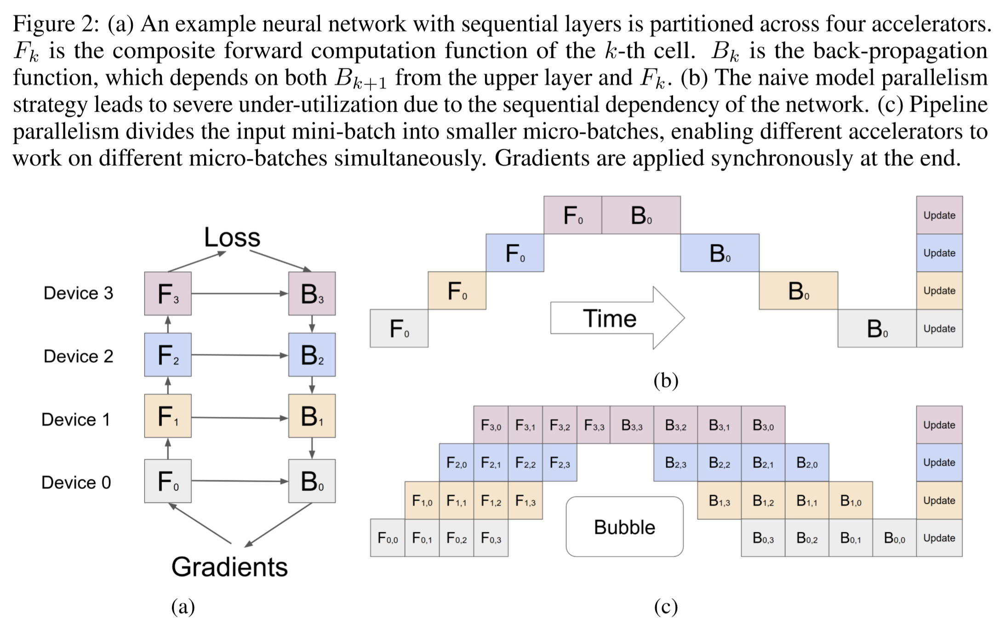

<slide :class="text-apple">
# Performance 1 {.aligncenter}
:::column {.vertical-align}

## Re-materialization
> "During forward computation, each accelerator only stores output activations at the partition boundaries. During the backward pass, the $k$-th accelerator recomputes the composite forward function $F_k$ "

## Notations
$N$: Mini-batch size  
$M$: Micro-batch size  
$L$: Number of Layers  
$K$: Number of Partitions

---

### Peak Activation Memory w/ Re-materialization
#### $O(N + \frac{L}{K} \times \frac{N}{M})$

### Peak Activation Memory for PipeDream
#### $O(N \times L)$

<slide :class="text-apple">
# Performance 2 {.aligncenter}
:::column {.vertical-align}

## Bubble Overhead
#### $\approx O(\frac{K-1}{M+K-1})$

<hr />

> In our experiments, we found the bubble overhead to be negligible when $M ≥ 4 × K$. This is also partly because re-computation during the backward pass can be scheduled earlier, without waiting for the gradients from earlier layers.

---

| TPU | AmoebaNet | Transformer |
| :---: | :---: | :---: |
| $K=$ | $8$ | $8$ |
| $M=$ | $32$ | $32$ |
| Speedups on TPUs | $3.48$ | $6.3$ |
| Speedups on GPU w/out high-speed interconnect | $2.7$ | $3.3$ | 

> In contrast, the AmoebaNet model achieves sub-linear speedup due to its imbalanced computation distribution. 
> ==3 Performance Analysis==
> {.text-quote}


<slide class="bg-apple aligncenter">
# Comparison btw/ GPipe and PipeDream


<slide :class="text-apple">
## GPipe's comment on PipeDream
> To avoid optimization issues stemming from the weight staleness, PipeDream requires maintaining multiple versioned copies of the model parameters on each accelerator in order to compute the gradient updates accurately, preventing users from scaling to bigger models.

## Aaron's comment on GPipe
> GPipe performs forward passes followed by backward passes for every m minibatches, aggregating weight gradients along the way; it also does not store intermediate state generated during the forward pass needed for the backward pass, instead opting to re-compute them. As a result, it suffers from reduced hardware efficiency due to re-computation overheads and frequent pipeline flushes every m minibatches.


<slide :class="text-apple">
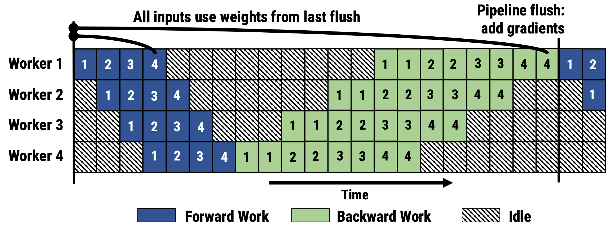

<slide :class="text-apple">
## Aaron's Performance Comparison
> "We compare training GNMT-16 using PipeDream and our implementation of GPipe using 16 GPUs on Cluster-A and Cluster-B. GPipe does not provide an algorithm for partitioning work across stages, so we use the same partitions as PipeDream. GPipe also does not provide an algorithm for how many items should be permitted into the “pipeline” (pipeline depth). When we set the pipeline depth to be equivalent to “NOAM” in PipeDream, GPipe experiences **55% and 71% throughput slowdowns** compared to PipeDream on Cluster- A and Cluster-B, respectively. Setting the pipeline depth for GPipe to the largest number that does not cause an out-of-memory exception, leads to throughput slowdowns of 35% and 42% on Cluster-A and Cluster-B, respectively. Note that, unlike PipeDream, GPipe may suffer from reduced statistical efficiency because each weight is updated only when the pipeline is flushed, but we did not explicitly measure this."
> ==Aaron Harlap Dissertation==
> {.text-quote}

<slide class="bg-black-blue text-apple aligncenter" image="https://rongyi.io/wp-content/uploads/2019/05/angelwing.jpg .dark">

## References {.aligncenter}
:::column {.vertical-align}

[1]: Dean, Jeffrey, et al. "Large scale distributed deep networks."  
[2]: Saliya Ekanayake. "Model Parallelism in Deep Learning is NOT What You Think"  
[3]: Aaron Harlap, et al. "PipeDream: Fast and Efficient Parallel DNN Training"  
[4]: Alex Krizhevsky. "One weird trick for parallelizing convolutional neural networks"  
[5]: Anand Jayarajan, et al. "Priority-based Parameter Propagation for Distributed DNN Training"  
[6]: Yanping Huang, et al. "GPipe: Efficient Training of Giant Neural Networks using Pipeline Parallelism"  
[7]: Tal Ben-Nun, Torsten Hoefler. "Demystifying Parallel and Distributed Deep Learning: An In-Depth Concurrency Analysis"  
[8]: Varun Batra "PipeDream" http://pages.cs.wisc.edu/~shivaram/cs744-slides/cs744-pipedream-varun.pdf  
[9]: Aaron Harlap "Dissertation: Improving ML applications in shared computing environments"

---

[:fa-github: Source code of this presentation](https://github.com/LER0ever/Presentations){.button.animated.delay-1s.fadeInUp .alignright}
