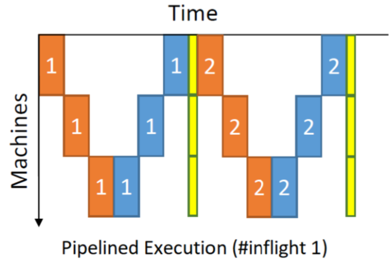
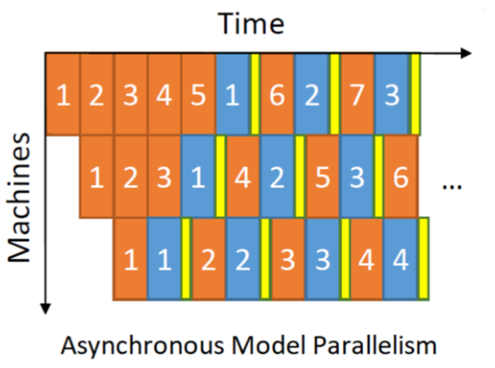
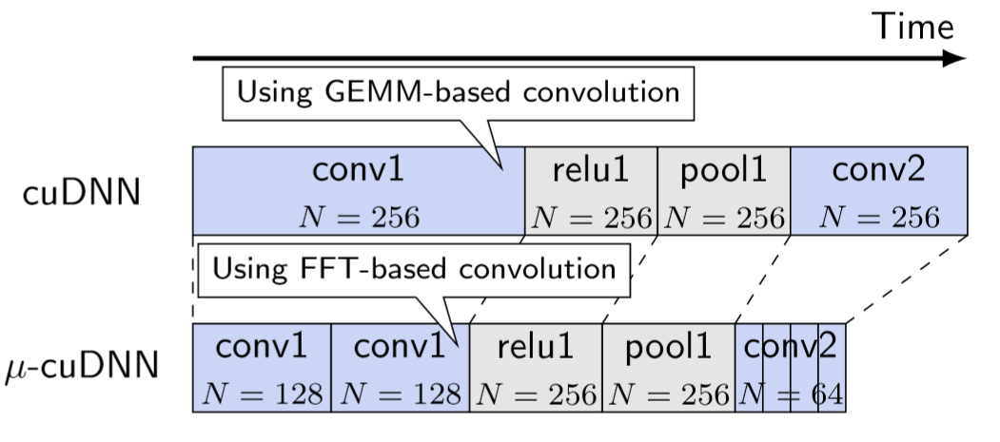

title: P3、PipeDream、GPipe - Large-Scale Distributed Training Modern Approaches
speaker: 荣懿 <i@rongyi.io>
url: https://rongyi.io
prismTheme: solarizedlight
js:
    - https://www.echartsjs.com/asset/theme/infographic.js
plugins:
    - echarts: {theme: infographic}
    - mermaid: {theme: forest}
    - katex

<slide class="bg-apple aligncenter">

# P3、PipeDream、GPipe {.text-shadow}

Large-Scale Distributed Training - Modern Approaches {.text-intro.animated.fadeInUp.delay-500 .text-shadow}

<br /><br /><br /><br /><br /><br />

> 荣懿 \<i@rongyi.io\>

Link to this presentation ```https://p.rongyi.io/190809```

<!--[:fa-link: Github](https://github.com/ksky521/nodeppt){.button.ghost.animated.flipInX.delay-1200}-->

<slide class="size-60 aligncenter text-apple">

## Background

---

### 1. Training Process {.text-shadow .animated.fadeInUp}  
### 2. Data Parallelism (_input partitioning_) {.text-shadow .animated.fadeInUp}  
### 3. Model Parallelism (_network structure partitioning_) {.text-shadow .animated.fadeInUp}  
### 4. Pipelining (_layer partitioning_) {.text-shadow .animated.fadeInUp}  
### 5. Hybrid Pipelining {.text-shadow .animated.fadeInUp}  


<slide :class="aligncenter text-shadow text-apple">

# The Training Process
## DNN Architecture

---


<slide :class="aligncenter text-shadow text-apple">

# The Training Process
## Forward Evaluation & Backpropagation


<slide :class="aligncenter text-apple">

# Data Parallelism {.text-shadow}
:::column {.vertical-align}

#### The **data** is partitioned across multiple GPUs
#### Each GPU has a full copy of the model     
#### Train on its own weight
#### Synchronize with other GPUs

---


<slide :class="text-apple">

# Problems with Data Parallelism {.text-shadow .aligncenter}
:::column {.vertical-align}

## Sync Strategy
#### Bulk Synchronization Parallel (BSP)
#### Asynchronous Parallel (ASP)

## Bottlenecks
#### Batch Normalization & Weight Updates

---


---

## Finer-Grained Data Parallelism
#### Pipelined Execution
#### Asynchronous Execution 
#### Decompose Minibatch

<slide :class="text-apple">

# Improving Data Parallelism {.text-shadow .aligncenter}
:::column {.vertical-align}




---



---



### Convolution Decomposition


<slide :class="aligncenter text-apple">

# Model Parallelism {.text-shadow}
:::column {.vertical-align}

#### The **model** is partitioned across multiple GPUs
#### Each GPU train only a portion of the model   
#### Saves GPU memory with only a partial model
#### Requires communication after each layer

---


<slide :class="text-apple">

# Problems with Model Parallelism {.text-shadow .aligncenter}
:::column {.vertical-align}

## GPU Under-Utilization

## Data Partitioning Point Solution

## Communication after every layer
#### Fully connected layer (FC) requires an all-to-all communication

---


<slide :class="aligncenter text-apple">

# Pipelining {.text-shadow}
:::column {.vertical-align}

## Variant 1
#### Overlapping computation between one layer and the next
##### Forward Evaluation
##### BackPropagation
##### Weight updates

## Variant 2
#### Partition DNN according to depth and assign layers to different GPUs


---


<slide :class="text-apple">

# Pipelining Var.2 (Layer partitioning) {.text-shadow .aligncenter}
:::column {.vertical-align}

## Pros
#### 1. No need to store full parameters on every GPU
#### 2. Communication pattern is fixed
#### 3. Layers at each GPU are fixed, allowing weight caching to decrease memory round-trips

---

## Cons
#### 1. Data has to arrive at a specific speed in order to fully utilize the system
#### 2. Latency proportionally increase with number of GPUs


<slide class="bg-apple aligncenter">
# Priority-Based Parameter Propagation

## For Distributed DNN Training

---

### A.K.A. P3

--- 

University of British Columbia & Vector Institute

<slide :class="text-apple">

# Observations {.text-shadow .aligncenter}
:::column {.vertical-align}

## 1. Temporal gap between data generated and consumed

## 2. Finer sub-layer-level granularity improves network utilization {.aligntop}
#### Heavy models with skewed weight size
##### VGG16, VGG19
##### Sockeye

---


<slide :class="text-apple">

# 1. Priority-based Propagation {.text-shadow .aligncenter}
:::column {.vertical-align}


---


<slide :class="text-apple">

# 2. Parameter Slicing {.text-shadow .aligncenter}
:::column {.vertical-align}


---


<slide class="bg-apple aligncenter">
# PipeDream

## Fast and Efficient Pipeline Parallel DNN Training


--- 

Carnegie Mellon University  
Microsoft Research  
Stanford University  

<slide :class="text-apple size-60">

# Observations {.text-shadow .aligncenter}
:::column {.vertical-align}

## 1. Data Parallelism BSP scenarios


---

## 2. Model Parallelism: only 1 GPU at work


<slide :class="text-apple size-50">

# Observations {.text-shadow .aligncenter}
:::shadowbox

# Pipeline Parallelism
a combination of Data-, Model- Parallelism and Pipelining

---

# Layer Partitioning
The partitioning is done after a profiling run, so as to make sure each stage gets the similar amount of work, and data communicated across stages are minimized.

---

# Work Scheduling
Pipelining w/ _one-forward-one-backward_(1F1B) to make sure forward is progressing in each minibatch. Round-robin load balancing for Data Parallelism.

:::


<slide :class="text-apple">
:::column {.vertical-align}
# 1. Pipeline Parallelism

## Observation from Google
#### Data Parallelism on Convolutional Layers
#### Model Parallelism on Fully-Connected Layers
[4]: One weird trick for parallelizing convolutional neural networks - Google

## with PipeDream
#### Data Parallelism on large Convolutional Layers
#### Pipelined Model Parallelism on the entire net

---


<slide :class="text-apple">
:::column {.vertical-align}
# 2. Layer Partitioning
### Duing the profiling
##### the following data is recorded for each layer l
- $T_l$: total computation time across forward and backward pass for the layer
- $a_l$: the size of the output activations of the layer, and the size of input gradients in the backward pass.
- $w_l$: the size of parameters for layer $l$

---


<slide :class="text-apple">
# 2. Layer Partitioning {.aligncenter}
### Partitioning Algorithm {.aligncenter}

:::column {.vertical-align}

### Notations
#### Train a DNN with $N$ layers across $M$ available machines
#### $A(j,m)$ denotes the time taken by the slowest stage in the **optimal** pipeline between layer 1 and $j$ using $m$ machines
#### $T(i \rightarrow j, m)$ denotes the time taken by a single stage spanning layers $i$ through $j$, replicated over $m$ machines
##### $T(i \rightarrow j, m) = \frac{1}{m} max (\sum_{l=i}^{j} T_l, \sum_{l=i}^{j} W_l^m)$

---

### DP Formula
#### Case 1: Optimal pipeline only has 1 stage
#### $A(j,m)=T(1\rightarrow j, m)$

#### Case 2: Optimal pipelien contains multiple stages


<slide :class="text-apple">
:::column {.vertical-align}
# 3. Work Scheduling
### Startup phase
##### inputs stage emits `NOAM` minibatches to the pipeline
### Steady phase
##### each stage alternates between forward and backward pass for a minibatch (1F1B)

### for stages w/ Data Parallelism config
#### Round-Robin between multiple GPUs

---


<slide :class="text-apple">
# Effective Learning
:::column {.vertical-align}
## 1. Weight Stashing
#### Maintain multiple versions of weights
##### Within a stage, same version of parameters are used for Forward and Backward pass of a given minibatch

---

## 2. Vertical Sync
#### Full synchronization of parameters
##### Eliminates the potential inconsistency _across stages_
footnote from paper: impact of vertical sync is negligible, disabled by default


<slide class="bg-apple aligncenter">
# GPipe

### Easy Scaling with Micro-Batch Pipeline Parallelism


--- 

Google


<slide :class="text-apple size-70">


<slide :class="text-apple">
# Performance {.aligncenter}
:::column {.vertical-align}

## Bubble Overhead
#### $\approx O(\frac{K-1}{M+K-1})$

## Memory w/ re-materialization
#### $\approx O(N+\frac{L}{K}\times \frac{N}{M})$

$\frac{N}{M}$ is the micro-batch size  
$\frac{L}{K}$ is # of layers per partition

---

| TPU | AmoebaNet | Transformer |
| :---: | :---: | :---: |
| $K=$ | $8$ | $8$ |
| $M=32$ | $3.48$ | $6.3$ |

> In contrast, the AmoebaNet model achieves sub-linear speedup due to its imbalanced computation distribution. 
> ==3 Performance Analysis==
> {.text-quote}

<slide class="bg-black-blue text-apple aligncenter" image="https://rongyi.io/wp-content/uploads/2019/05/angelwing.jpg .dark">

## Thank You {.aligncenter}
:::column {.vertical-align}


#### References {aligncenter}

[1]: Dean, Jeffrey, et al. “Large scale distributed deep networks.”  
[2]: Saliya Ekanayake. "Model Parallelism in Deep Learning is NOT What You Think"  
[3]: Aaron Harlap, et al. "PipeDream: Fast and Efficient Parallel DNN Training"  
[4]: Alex Krizhevsky. "One weird trick for parallelizing convolutional neural networks"

---

[:fa-github: Source code of this presentation](https://github.com/LER0ever/Presentations){.button.animated.delay-1s.fadeInUp .alignright}
