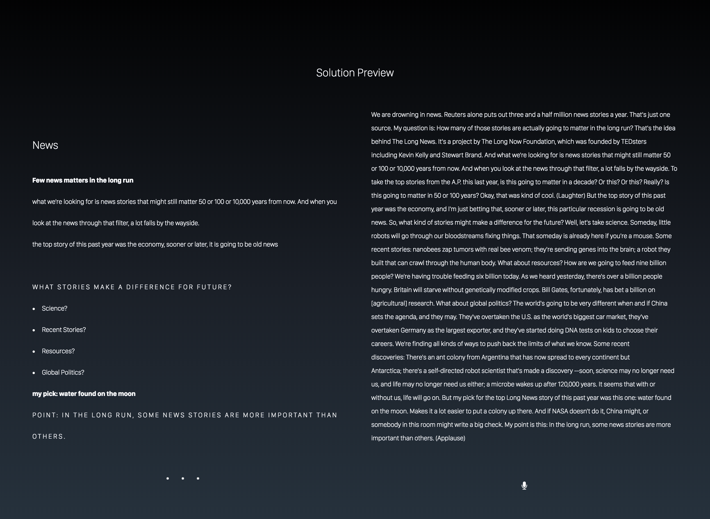

:title: L.E.R IRP Presentation
:data-transition-duration: 1500
:css: irp.css
:js: irp.js

Presentation source for ESL 118 Independent Research Paper

Powered by hovercraft, EverVim, and Impress

----

:id: frontpage

.. raw:: html

   

       

          
          
           
          <h1>vs</h1>
           
          
        

        <h1 class="number">Note Taking</h1>
        <h4>Presented by Everette Rong</h4>
        <h1>&nbsp;</h1>
        
A Technological Approach towards a More Effective Way of Note Taking

    

.. note::

    Testing the presenter's console. Nobody should see this. Trigger: [first of all]

----

:data-x: r0
:data-y: r0
:data-z: r-200
:data-scale: 0.1
:id: background

.. raw:: html

    <h1>Background</h1>
    <h6>in numbers</h>

.. note::

    First of all, I want to introduce some backgrounds on this topic. Here in United States, 

----

:data-rotate-y: 180
:data-scale: 3
:data-x: r-2500
:data-y: r0
:data-z: r3000
:id: bg-99

.. raw:: html

      

        

          

            99%
          

        

        <!--end .number -->
        

          <h3>College students take notes in lecture.</h3>
        

        <!--end .benefit -->
      

.. note::

    99 percent of college students actually take notes in class. So if we pick a class of a hundred students,
    only one of them would sit in the lecture hall and do nothing during the lecture.
    Most of us, 99 percent, are more or less engaged in note taking. However,

----

:data-x: r-3500
:data-y: r1750
:data-z: r3500
:id: bg-0

.. raw:: html

          

            

              

                0
                  ^
                
              

            

            <!--end .number -->
            

              <h3>Colleges offer to teach students how to take notes effectively.</h3>
            

            <!--end .benefit -->
          

.. note::

    almost none of the colleges offers to teach students how to effectively take notes.
    So we just kind of teach ourselves on that and figure out what is the best way to do it.
    Among those 99 percent who take notes, 

----

:data-y: r1750
:data-z: r3500
:data-rotate: 90
:id: by-hand

.. raw:: html

    

        

          <figure>
            
            <figcaption>
              <a href="https://rongyi.blog" title="Longhand Note Taking">
                Longhand Note Taking
              </a>
            </figcaption>
          </figure>
          <!-- end figure-->
          

            <h2>
              Writing notes by hand
            </h2>
          

          <!-- end .flex-content-->
        

        <!-- end .card-50-->
    

.. note::

    they could either write down their notes by hand on the notebooks, 

----

:data-x: r0
:data-y: r500
:data-scale: 0.1

.. raw:: html

    

        

          

            <h2>
              Typing notes on laptop
            </h2>
          

          <!-- end .flex-content-->
          <figure>
            
            <figcaption>
              <a href="https://rongyi.blog" title="Computer Note Taking">
                Digital Note Taking
              </a>
            </figcaption>
          </figure>
          <!-- end figure-->
        

        <!-- end .card-50-->
    

.. note::

    or they can type them on their laptops or tablets.

----

:data-x: r-800
:data-scale: 1

.. raw:: html

          <h2 align="middle">Computer vs Longhand</h2>
          

          

            

              

                
                  60%
                
              

            

            <!--end .number -->
            

              

                
                  40%
                
              

            

            <!--end .benefit -->
          

          <!--end .cta -->

.. note::

    And in a Stanford computer science course, the fraction of these two is about 60 40,
    so more than half of college students start to use laptops for note taking, 

----

:data-y: r-800
:data-x: r500
:data-z: r2500
:data-rotate-x: -180

.. raw:: html

          

            
Is note taking

            <h2 class="text-landing">Necessary?</h2>
          

          

          <ul class="flexblock specs">
            <li>
              

                <h1>
                  Improves Learning
                </h1>
                Crawford (1925)
              

            </li>
            <li>
              

                <h1>
                  Helps Reviewing
                </h1>
                Fisher &amp; Harris (1973)
              

            </li>
          </ul>

.. note::

    I started my research by asking myself a relatively easy question, that is do we even need to take notes in order to achieve academic success?
    And of course the answer is yes, we should take notes, not because that’s what 99 percent of people do,
    it’s because it indeed helps with both learning in class and reviewing after class.

----

.. raw:: html

        <section class="bg-apple">
            

              <h1 class="content-center">Problems</h1>
              <h2>Longhand</h2>
              <ul class="flexblock features">
                <li>
                  

                    <h2>
                      Too Slow
                    </h2>
                    wasted time, incomplete notes.
                  

                </li>
                <li>
                  

                    <h2>
                      Not Searchable
                    </h2>
                    Hard to locate previous notes.
                  

                </li>
              </ul>
              <h2>Typing</h2>
              <ul class="flexblock features">
                <li>
                  

                    <h2>
                      Distracting
                    </h2>
                    Surfing, chatting, gaming
                  

                </li>
                <li>
                  

                    <h2>
                      Inefficient
                    </h2>
                    compared to writing notes
                  

                </li>
              </ul>
            

        </section>

.. note::

    But I found the current methods most of college students are using are not perfect.
    The problem of writing notes is that it is just too slow to write,
    I do longhand note taking in my economics class and I end up spending 2 thirds of the class writing thing down,
    and sometimes I still have to go to the professor to get the missing parts after class.
    Also it is not easy to search on a paper full of notes, especially when you tried to find some concepts from your last year’s notes,
    it’s gonna take forever. And if you choose to type notes, you’ll probably find out that the laptop is a huge distraction,
    you can do almost everything on it. In fact if you try to sit at the back of a lecture hall,
    you can see a lot of ebays, messengers, youtubes or even video games if the lecture hall is large enough.
    Also, plenty of research suggests that students don’t learn as much when they type notes,
    compared to writing notes, which I’ll explain in the later slides.

----

:data-x: r0
:data-y: r-7000
:data-z: r0
:data-rotate: r90
:id: trifecta

.. raw:: html

          <h3>3 Main Factors Affecting Note Taking Performance</h3>
          

          

            <ul class="flexblock reasons">
              <li>
                <h2>Selective Filtering Process</h2>
                
Filter out the unimportant, pick the part worth taking down

              </li>
              <li>
                <h2>Fraction of lecture paying attention to the professor</h2>
                

                  Time spent on writing notes, surfing the web, or anything other than listening to the professor are excluded
                

              </li>
              <li>
                <h2>Amount of notes for later review</h2>
                

              </li>
            </ul>
          

.. note::

    Then my research went on to the question of what essentially determines the performance or the efficiency of note taking,
    and from the papers I read, they all came down to these three main factors. The first one is selective filtering,
    the second one is how much time you are actually focusing on the professors’ speech, the last one is how much you’ve got for later review. 

----

:data-x: r-1000
:data-y: r-600
:data-z: r-6000
:data-rotate: r0

1. Selective Filtering
========================
Filter out the unimportant, pick the part worth taking down

.. note::

    So what is selective filtering. It is a process in which students are actively engaged in filtering out things
    that are less important to them and writing down what they think is worth writing down. So basically it’s a choosing process.
    And this choosing process is proved to actually help us learn much better compared to those who don’t have this process
    going on when they are attending lectures, this is because it greatly improves the conceptual understanding of the material.
    The next two is quite easy to understand.

----

:data-x: r0
:data-y: r1000
:data-z: r0

2. Fraction of lecture paying attention to the professor
==========================================================
Time spent on writing notes, surfing the web, or anything other than listening to the professor are excluded

.. note::

   This means the fraction of time spent on the actual lecture. So that would exclude the time for browsing the web,
   chatting on social networks and instant messages, and taking notes. Now many of you may wonder why note taking is excluded as well.
   It is because most of us are not able to multitask, so if say a student is busy writing things down, he or she is not paying full attention to the professor.

----

3. Amount of notes for later review
====================================
The more the better

.. note::

    The last factor is the amount of notes for later review, this one is obvious.
    If you have more detailed notes to review, especially when it comes to the final week, it’s absolutely better than having nothing to rely on.

----

:data-x: r0
:data-y: r-800
:data-z: r-3000
:data-rotate: r0

.. raw:: html

        

            

              <h1>Longhand Writing</h1>
            

            <!-- end .content-left -->
            

                <h4>
                    <ul>
                        <li>Selective Filtering</li>
                        <li>Small portion of time spent on the actual lecture</li>
                        <li>Some amount of non-searchable notes</li>
                    </ul>
                </h4>
            

            

            <!-- end .content-left -->
            

              <h1>Laptop Typing</h1>
            

            <!-- end .content-left -->
            

                <h4>
                    <ul>
                        <li>Mindless typing</li>
                        <li>Considerable amount of time paying attention to the professor</li>
                        <li>Detailed searchable notes</li>
                    </ul>
                </h4>
            

            <!-- end .content-left -->
        

.. note::

    So now that we have these three factors that determines the effect of note taking on our academic performance,
    it is not hard to see the downside of our current methods. Students who choose to write notes, will have that choosing process going on,
    but they will end up wasting lots of lecture time on writing, and may not have much to refer back to later on.
    While those who type their notes may have more notes, more lecture time but they don’t have that cognitive process.

----

:data-x: r2000
:data-y: r0
:data-z: r0

.. raw:: html

    

        <h4 class="text-landing">Other Modern Approaches</h4>
        

        <h2>1. OneNote - write digitally</h2>
        <blockquote><h4>"only users who excelled at elementary school handwriting lessons will find the process automatic"</h4></blockquote>
        

        <h2>2. Livenotes - Collaborative Note Board</h2>
        <h4>Students end up getting lower grades</h4>
        <h2>...</h2>
    

.. note::

    So since the 21st century, people have been busy coming up with several new ways to help students take better notes,
    one of them is OneNote from Microsoft. Basically if you have an ipad or a surface pro, you can just write on OneNote and
    it will automatically recognize your scripts using Optical Character Recognition. So I tried that yesterday,
    just like the comment I saw in one of the research papers, it is fine if the user write in a straight line in a printed style,
    but when I try doing normal note taking stuff like writing equations and drawing graphs, the recognition result just gets really funny.
    Another approach is from UC Berkeley, called Livenotes, where students can collaboratively take notes. It’s a kind of white board,
    with the powerpoint in the middle, and you can scribble all over it, together with other students.
    It’s really interesting and it turns out that students who use this get lower grades than normal students. 

----

:data-x: r-1000
:data-y: r0
:data-z: r-3000
:data-rotate: r180
:data-scale: 0.3

.. note::

    So what I proposed in my paper, is kind of somewhere between writing notes and typing notes.
    I call it computer-aided note taking because the laptop will do most of the work and students
    only need to select and copy paste what they want. That’s a quick demonstration of how it works,
    it’s a two column layout software, on the right hand side, the content is automatically generated
    using real-time speech recognition, and as many of you may notice, I have it here at the bottom of my slides,
    it’s the same thing, and what students need to do is to select what they want, copy to the left and organize them. 

----

:data-x: r0
:data-y: r0
:data-z: r500
:data-rotate: r0
:data-scale: 0.1

.. raw:: html

    

        <h1>Computer-Aided Note-Taking</h1>
        

        <h3>
            <ul style="text-align: left;">
                <li>Selective Filtering</li>
                <li>Fraction of time spent on professor's speech</li>
                <li>Amount of notes for later review</li>
            </ul>
        </h3>
    

.. note::

    And according to the three main factors that contribute to the note taking efficiency, they still have this
    selective filtering process because they have to select from a huge chunk of text, and they can now focus more
    on the actual lecture because they no longer need to spend a lot of time taking care of their notes, also,
    they have plenty of material for later review, because they get both a complete version of lecture notes
    on the right, and their own organized version on the left. 

----

:data-x: r2000
:data-y: r500
:data-rotate: r0
:data-scale: 1

Conclusion
======================================

Note taking is necessary for college students.

According to the three factors,
Longhand and Laptop note taking both have drawbacks.

Computer-Aided Note Taking would help students

- stay focused in lecture
- spend less time on the process of taking notes
- still have plenty of notes for later review

.. note::

    In conclusion, we need to take notes, but we are currently doing it in a not very efficient fashion,
    and my solution would be using the computer to help students take notes more efficiently.
    That's all for my part, thank you.

----

:data-x: 1000
:data-y: 0
:data-z: 2000
:data-rotate: 180
:data-scale: 0.5

Thank You!
===============

.. image:: images/qa.png

.. raw:: html

   

   <h5>Made with Impress.js</h5>
   <h6>by Everette</h6>
