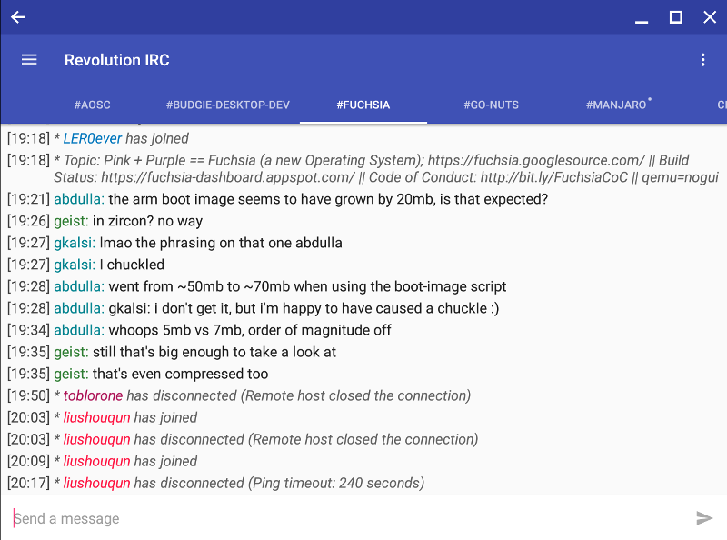
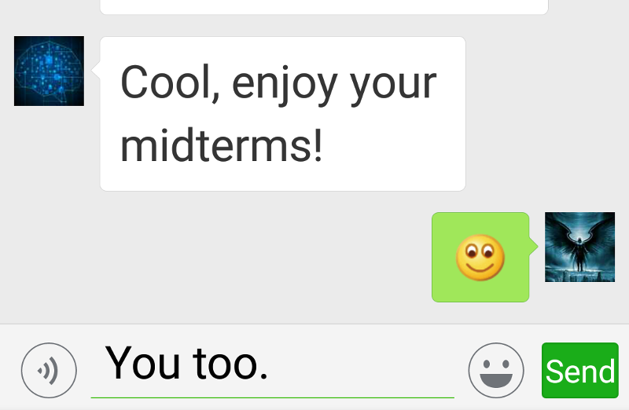

:title: Paper 1 Presentation
:data-transition-duration: 1500
:css: p1p.css
:slide-numbers: true

Presentation source for ESL 118 Paper 1

----

Paper 1 Presentation

Modern Communication Media
===========================
vs
===

Face-to-face conversation
==========================

*Presented by* `Everette Rong <https://rongyi.blog/contact>`_

----

:data-x: r0
:data-y: r0
:data-z: r-200
:data-scale: 0.1

Background
-------------------

.. raw:: html

    <table style="width:100%;height:70vh;">
      <tr>
        <th rowspan="12" style="width:30%"></img></th>
        <th rowspan="4" style="width:40%"></img></th>
        <th rowspan="3" style="width:30%"></img></th>
      </tr>
      <tr>
      </tr>
      <tr>
      </tr>
      <tr>
        <td rowspan="3"></img></td>
      </tr>
      <tr>
        <th rowspan="4"></img></th>
      </tr>
      <tr>
      </tr>
      <tr>
        <td rowspan="3"></img></td>
      </tr>
      <tr>
      </tr>
      <tr>
        <th rowspan="4"></img></th>
      </tr>
      <tr>
        <td rowspan="3"></img></td>
      </tr>
      <tr>
      </tr>
      <tr>
      </tr>
    </table>

----

:data-rotate-y: 180
:data-scale: 3
:data-x: r-2500
:data-y: r0
:data-z: r3000

Main idea
==============================================

.. raw:: html

    <ul style="padding-left: 20vw;">
        <li>Modern Communication Media </img></li>
        <ul>
            <li>Convenience : </img></li>
            <li>Problems : </img></li>
            <ul>
                <li>Quality ↓</li>
                <li>Efficiency ↓</li>
                <li>Effectiveness  ↓</li>
            </ul>
        </ul>
        <li>Face-to-face conversation </img></li>
    </ul>

----

:data-x: r-3500
:data-y: r1750
:data-z: r3500

Modern Communication Media
----------------------------
Benefits?

.. image:: modern-communication-media.jpg
   :height: 517px
   :width: 600px
   :scale: 100 %

----

:data-y: r1750
:data-z: r3500
:data-rotate: 90

Problems for Phone, Wechat, Skype, etc.?
======================================================================================

* Quality
* Effectiveness & Efficiency

----

:data-x: r0
:data-y: r500
:data-scale: 0.1

Quality compromised
===================================

.. image:: phubbing.png
   :height: 642px
   :width: 720px
   :scale: 100 %

----

:data-x: r-800
:data-scale: 1

Quality & Efficiency ↓
===========================================

----

:data-y: r-800
:data-x: r500
:data-z: r2500
:data-rotate-x: -180

Effectiveness ↓
====================================

----

What about face-to-face conversation?
-------------------------------------

.. image:: face-to-face-1.jpg
   :height: 558px
   :width: 666px
   :scale: 100 %

----

:data-x: r0
:data-y: r-7000
:data-z: r0
:data-rotate: r90

1. Synchronizes your brain with others
-------------------------------------------

----

:data-x: r0
:data-y: r-800
:data-z: r-3000
:data-rotate: r0

2. Creativity & quality of teamwork
------------------------------------------------

----

:data-rotate: r180
:data-scale: 0.3

F2F is irreplaceable
=========================================================================

.. raw:: html

    

Try more Face-to-face conversation

Use phones/SNS on demand

----

:data-x: r2000
:data-y: r500
:data-rotate: r0
:data-scale: 1

Conclusion
======================================

* Modern communication media brings much convenience in term of communication
* But they have problems
* We should still maintain the sufficient amount of F2F conversation

----

:data-x: 0
:data-y: -3500
:data-z: 0
:data-rotate-x: r0
:data-scale: 0.5

**Thank You!**
===============

.. image:: question-and-answer.svg
   :height: 300px
   :width: 300 px
   :scale: 100 %

.. raw:: html

    

    .   
    <a href="https://github.com/LER0ever/Presentations" target="_blank">Made</a> with EverVim, HoverCraft and Impress   
    by Everette   
    

